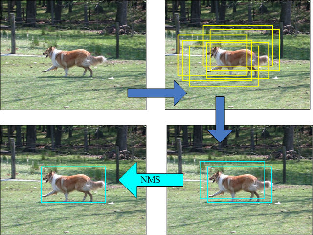

# Object-Detection-INTRO
目标检测入门以及挖坑中🔨

# 1. 目标检测概念与思路

# 2. 框定义

# 3. IOU

# 4. Anchor or Prior BoundingBOX ？

# 5. Model

# 6. 分类头回归头

# 7. Loss

原文损失函数详解：[3.5 损失函数 (datawhalechina.github.io)](https://datawhalechina.github.io/dive-into-cv-pytorch/#/chapter03_object_detection_introduction/3_5)

# 8. Train

结果（尝试过把batch从32改成16以及8，以下结果是batch为8的结果）：

Epoch: [0][0/2069]      Batch Time 5.305 (5.305)        Data Time 3.046 (3.046) Loss 27.0807 (27.0807)

Epoch: [0][100/2069]    Batch Time 0.125 (0.174)        Data Time 0.000 (0.031) Loss 6.1386 (8.3669)

Epoch: [0][200/2069]    Batch Time 0.135 (0.149)        Data Time 0.001 (0.015) Loss 6.4031 (7.3290)

Epoch: [0][300/2069]    Batch Time 0.127 (0.142)        Data Time 0.000 (0.010) Loss 5.5864 (6.9522)

Epoch: [0][400/2069]    Batch Time 0.123 (0.137)        Data Time 0.001 (0.008) Loss 5.9977 (6.7547)

Epoch: [0][500/2069]    Batch Time 0.128 (0.135)        Data Time 0.001 (0.006) Loss 5.4128 (6.6327)

Epoch: [0][600/2069]    Batch Time 0.126 (0.133)        Data Time 0.001 (0.005) Loss 5.7687 (6.5317)

Epoch: [0][700/2069]    Batch Time 0.119 (0.132)        Data Time 0.001 (0.005) Loss 5.3334 (6.4438)

Epoch: [0][800/2069]    Batch Time 0.130 (0.130)        Data Time 0.001 (0.004) Loss 5.7443 (6.3768)

Epoch: [0][900/2069]    Batch Time 0.120 (0.129)        Data Time 0.001 (0.004) Loss 5.2492 (6.3112)

Epoch: [0][1000/2069]   Batch Time 0.119 (0.129)        Data Time 0.000 (0.003) Loss 5.7327 (6.2540)

Epoch: [0][1100/2069]   Batch Time 0.130 (0.128)        Data Time 0.000 (0.003) Loss 5.1803 (6.1980)

Epoch: [0][1200/2069]   Batch Time 0.123 (0.128)        Data Time 0.001 (0.003) Loss 4.2925 (6.1452)

Epoch: [0][1300/2069]   Batch Time 0.120 (0.128)        Data Time 0.001 (0.003) Loss 5.3661 (6.1041)

Epoch: [0][1400/2069]   Batch Time 0.125 (0.128)        Data Time 0.000 (0.002) Loss 5.6441 (6.0609)

Epoch: [0][1500/2069]   Batch Time 0.124 (0.128)        Data Time 0.000 (0.002) Loss 4.6934 (6.0215)

Epoch: [0][1600/2069]   Batch Time 0.122 (0.128)        Data Time 0.000 (0.002) Loss 5.1628 (5.9778)

Epoch: [0][1700/2069]   Batch Time 0.129 (0.128)        Data Time 0.000 (0.002) Loss 4.8335 (5.9426)

Epoch: [0][1800/2069]   Batch Time 0.128 (0.127)        Data Time 0.000 (0.002) Loss 5.1207 (5.9062)

Epoch: [0][1900/2069]   Batch Time 0.117 (0.127)        Data Time 0.000 (0.002) Loss 5.0768 (5.8674)

Epoch: [0][2000/2069]   Batch Time 0.118 (0.127)        Data Time 0.001 (0.002) Loss 5.3326 (5.8337)

（貌似是欠拟合了。。一个epoch我就直接终止了。😓有空再回来分析代码）

# 9. NMS非极大值抑制

